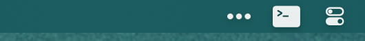

# AeroMenu

Show AeroSpace workspaces in the menu bar.




## Configure

You can configure the app using a TOML file at either ~/.aeromenu.toml or ~/.config/aeromenu/aeromenu.toml.

```toml
aeroSpacePath = "/opt/homebrew/bin/aerospace"
socketPath = "/tmp/aeromenu.socket"

# Print the workspace names next to the icon.
showWorkspaceNames = false

# Show all workspaces or only the focused ones.
showUnfocusedWorkspaces = true

# Customize workspace icons.
# You can use any symbol from Apple's SF Symbols. Focused workspaces will use
# the filled version of the icon if it's available for that symbol. In this
# example, my workspace named "1" is displayed using a terminal icon.
# Workspaces without an assigned icon will default to circles.
[workspaces]
1 = "apple.terminal"
2 = "text.page"
3 = "safari"
4 = "play"
5 = "ellipsis.bubble"
6 = "gamecontroller"
```

## SF Symbols

You can download SF Symbols from [developer.apple.com](https://developer.apple.com/sf-symbols/).

## Related projects

This is my first time writing Swift. I used [SketchyBar](https://github.com/FelixKratz/SketchyBar) for a while but wanted something simpler. Some other projects I really like are [AeroIndicator](https://github.com/rien7/AeroIndicator), which shows a floating window when pressing a modifier key, and [Barik](https://github.com/mocki-toki/barik/tree/main), which replaces the entire menu bar.
